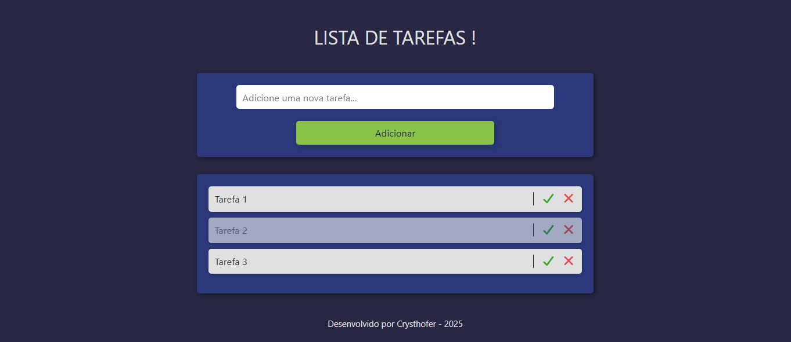

# Lista de Tarefas

Aplicação simples e funcional para criação e gerenciamento de tarefas, desenvolvida em HTML, CSS e JavaScript puro.
O objetivo do projeto é oferecer uma interface limpa, intuitiva e responsiva, permitindo adicionar, marcar como concluído e remover tarefas, com persistência de dados via LocalStorage.

---

## - Funcionalidades

* Adicionar novas tarefas.
* Marcar tarefas como concluídas.
* Remover tarefas da lista.
* Persistência de dados utilizando LocalStorage.
* Interface responsiva para dispositivos móveis.
* Estilo moderno utilizando variáveis CSS.
* Modal de alerta caso o usuário tente adicionar uma tarefa vazia.

---

## - Estrutura do projeto

```
├── index.html
├── assets/
│   ├── css/
│   │   ├── style.css
│   │   └── responsivo.css
│   ├── js/
│   │   └── index.js
│   └── imagens/
│       └── Logo.png
```

---

## - Tecnologias utilizadas

* HTML5
* CSS3
* JavaScript (ES Modules)
* Font Awesome (ícones)

---

## - Link Direto

* [https://crysthoferr.github.io/Lista-de-Tarefas/](https://crysthoferr.github.io/Lista-de-Tarefas/)

---

## - Prévia da Interface



---

## - Autor

Desenvolvido por *Crysthofer* — 2025
[GitHub](https://github.com/Crysthoferr)

---

## - Licença

Este projeto é de uso livre para fins de estudo e aperfeiçoamento pessoal.
